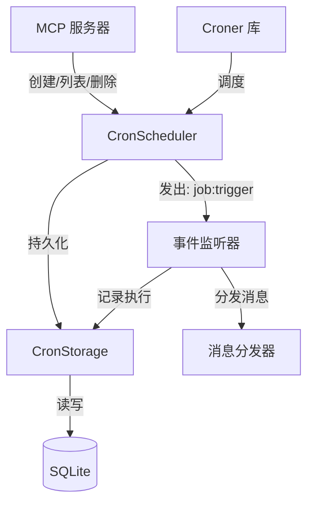

# 架构设计：重构 Cron 定时任务系统

> 创建时间：2026-03-27

## 设计目标

- 用高效的事件驱动调度替换低效的轮询
- 解耦任务执行和消息分发
- 提供持久化、可查询的执行历史
- 支持时区感知的调度
- 保持可测试性和简洁性

## 系统范围

- **影响的系统**：Cron 调度子系统
- **影响的模块**：`src/cron/`、MCP 服务器集成
- **不在范围内**：分布式调度、任务依赖、Web UI

## 架构决策

### 决策 1：Cron 库选型

**背景**：当前实现使用简陋的自定义 cron 解析器，仅支持基础模式且需要 60 秒轮询。

**考虑的选项**：
- **选项 A：node-cron**
  - 优点：流行，API 简单
  - 缺点：不支持时区，仅限 Node.js 定时器
- **选项 B：croner**
  - 优点：轻量（~10KB），支持时区，计算下次运行时间，兼容 Bun
  - 缺点：不如 node-cron 流行
- **选项 C：保留自定义解析器**
  - 优点：无依赖
  - 缺点：需要大量工作添加功能，容易出错

**决策**：使用 `croner`

**理由**：Croner 开箱即用支持时区，高效计算下次执行时间（无需轮询），且轻量。经过充分测试和维护。

### 决策 2：持久化层

**背景**：当前实现使用 JSON 文件存储，与项目其他地方使用 SQLite 不一致。

**考虑的选项**：
- **选项 A：保留 JSON 文件**
  - 优点：简单，无需模式变更
  - 缺点：无查询能力，无执行历史，文件损坏风险
- **选项 B：SQLite + 专用存储类**
  - 优点：与项目一致，可查询，支持执行历史，ACID 保证
  - 缺点：需要迁移脚本

**决策**：SQLite + 专用 `CronStorage` 类

**理由**：SQLite 与项目架构一致，支持执行历史追踪，提供更好的数据完整性。

### 决策 3：解耦策略

**背景**：调度器当前硬依赖 Dispatcher，导致测试困难且限制复用性。

**考虑的选项**：
- **选项 A：依赖注入 + 接口**
  - 优点：清晰，可测试
  - 缺点：需要定义接口，更多样板代码
- **选项 B：事件发射器模式**
  - 优点：完全解耦，支持多个监听器，符合 Node.js 习惯
  - 缺点：不如接口显式
- **选项 C：回调函数**
  - 优点：简单
  - 缺点：仅支持单个监听器，灵活性差

**决策**：事件发射器模式

**理由**：EventEmitter 提供最大灵活性，允许多个监听器（对日志、指标有用），是标准的 Node.js 模式。测试可以监听事件而无需 mock。

## 架构图

## 数据流

### 任务创建流程
1. MCP 工具 `cron_create` 被调用，传入任务参数
2. CronScheduler 验证输入（cron 表达式、时区）
3. CronStorage 将任务持久化到 SQLite
4. Croner 使用计算的下次运行时间调度任务
5. 返回任务 ID 给调用者

### 任务执行流程
1. Croner 在预定时间触发
2. CronScheduler 发出 `job:trigger` 事件，携带任务数据
3. 事件监听器（在主应用中）接收事件
4. 根据 `actionType` 执行不同动作：
   - `message`: 调用 Dispatcher 发送消息
   - `command`: 执行命令并捕获输出
   - `webhook`: 调用 HTTP webhook
5. 成功时：发出 `job:success`，记录结果到 `cron_executions`
6. 失败时：发出 `job:error`，记录错误到 `cron_executions`
7. 将执行结果汇报给用户（通过消息）
8. Croner 自动调度下次运行（对于周期性任务）

## 技术栈

| 技术 | 版本 | 用途 | 理由 |
|------------|---------|---------|-----------|
| croner | ^8.0.0 | Cron 调度 | 时区支持，高效计算 |
| bun:sqlite | 内置 | 持久化 | 与项目一致，ACID 保证 |

## 性能影响

- **预期性能变化**：
  - 消除 60 秒轮询，降低 CPU 使用率
  - 内存使用略微增加（每个任务一个 Croner 实例）
- **潜在瓶颈**：
  - 高频任务执行期间的 SQLite 写入
- **优化策略**：
  - 批量写入执行历史
  - 在 `job_id` 和 `executed_at` 列上建立索引

## 安全考虑

- **输入验证**：验证 cron 表达式以防止注入
- **时区验证**：根据 IANA 数据库验证时区字符串
- **授权**：MCP 服务器继承会话上下文（chatId、userId）
- **审计日志**：所有执行记录到 `cron_executions` 表

## 迁移策略

**推倒重建，无需迁移**

1. **阶段 1：实现新系统**
   - 创建 `CronStorage` 类和 SQLite 模式
   - 实现 `CronScheduler` 使用 Croner 和事件
   - 编写完整测试

2. **阶段 2：集成到主应用**
   - 实现 `src/mcp/cron-entry.ts` 将事件连接到 dispatcher
   - 实现 MCP 服务器工具
   - 集成测试

**注意**：旧的 JSON 文件格式不再支持，用户需要重新创建任务。

## 风险与缓解

| 风险 | 影响 | 概率 | 缓解措施 |
|------|--------|-------------|------------|
| Croner 库 bug | 任务不执行 | 低 | 全面测试，监控执行日志 |
| 时区边界情况 | 执行时间错误 | 中 | 文档化 DST 行为，使用经过充分测试的库 |
| 事件监听器失败 | 任务触发但不分发 | 中 | 添加错误处理，记录失败到执行历史 |
| 任务执行行为失败 | 行为触发失败 | 中 | 记录详细错误信息，支持重试机制 |

## 依赖

- **外部依赖**：`croner` 包（新增）
- **内部依赖**：`src/mcp/server.ts`（基类）、`src/dispatcher.ts`（事件监听器）
- **依赖方**：使用 cron 工具的 MCP 客户端

---

**状态**：🟡 草稿
